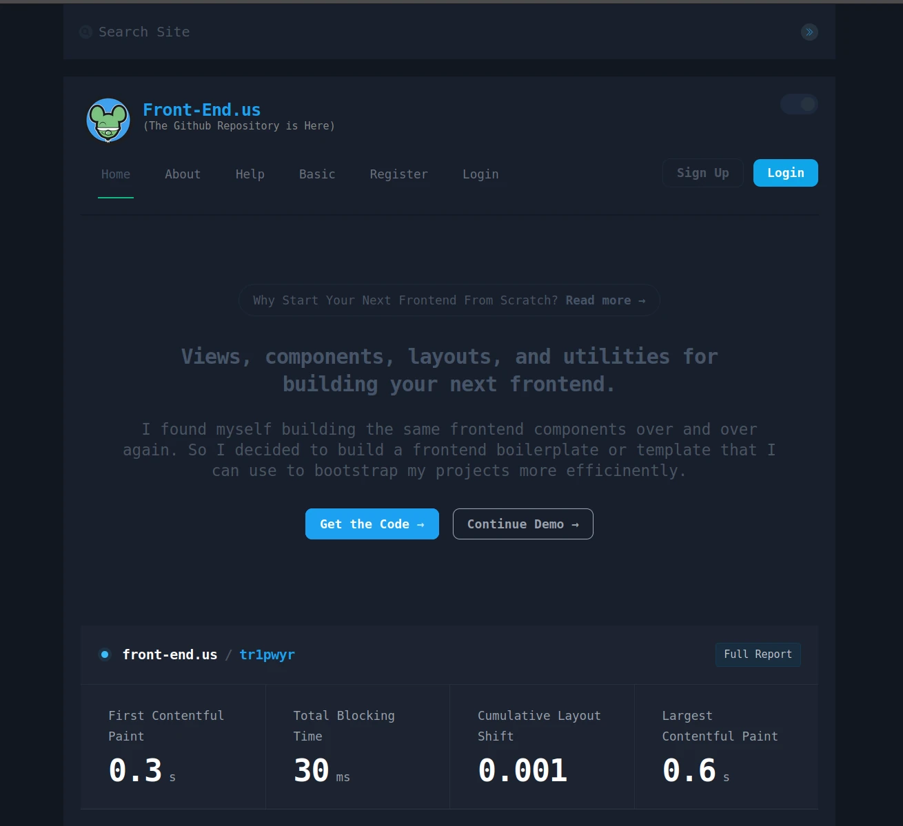

## Front-End.us   : 0.1.1
##### [https://front-end.us/](https://front-end.us)

##### Front-End.us is a frontend template that I use to bootstrap my projects.  It is built with the following technologies:

- Vite
- Vue3
- TailwindCSS


I found myself building the same frontend components over and over again. So I decided to build a frontend   template that I can use to bootstrap my projects more efficinently.  I decided to open source it so that others can benefit from it as well.  I hope you enjoy it.

I will be adding more components as I build them.  If you have any suggestions, please feel free to open an issue or submit a pull request.



### Installation

```bash
npm install
```

### Usage

```bash
npm run dev
```

### Build

```bash
npm run build
```


### Todo List

- Change out all script to script setup
- Finish creating custom CSS
- Add tests
- Add documentation
- Fix the current page in the menu?

### License
Copyright 2023 [James Turner Dev](https://james-turner.dev)
This project is licensed under the MIT License - see the [LICENSE](LICENSE) file for details